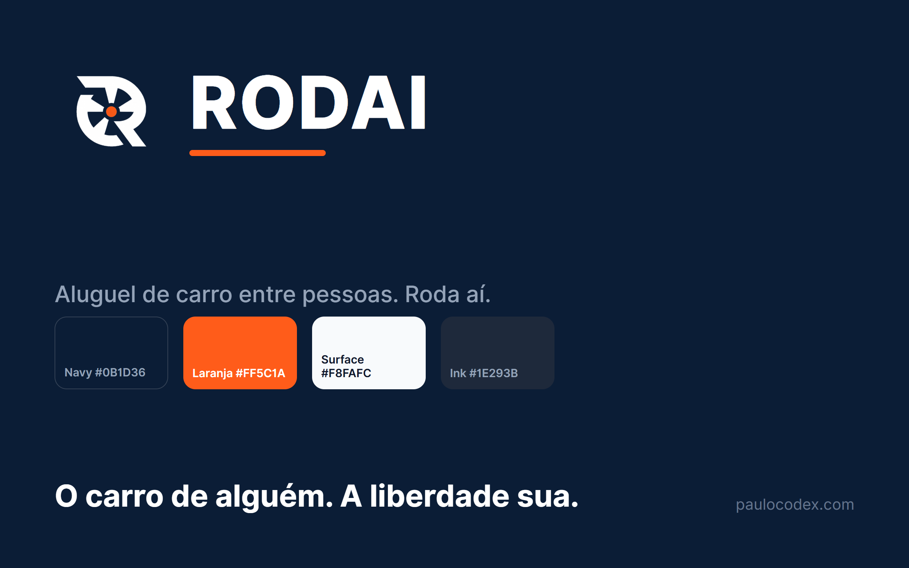

  

<h1 align="center">RODAI</h1>

<b>Aluguel de carro entre pessoas (P2P)</b> Roda aí. O carro de gente de verdade, pertinho de você.

  
  
  
  

---

## PT-BR

**RODAI** é o jeito de gente comum alugar (e ganhar com) um carro — com segurança e sem burocracia de locadora. Você aluga o carro de uma pessoa de verdade, perto de você. Mercado inicial: **Porto Velho / Brasil**.

**O que o app faz:** cadastro + verificação de CNH · anunciar seu carro · buscar e reservar · pagamento em **custódia** (o dinheiro só vai pro dono depois da devolução) · **vistoria com prova** (foto + data + local) · chat seguro · disputa com mediação · avaliação dos dois lados.

**Por que é diferente:** custódia do pagamento, vistoria imutável visível aos dois lados, e regras claras contra cobrança surpresa — as maiores dores de quem usa concorrentes lá fora.

## EN

**RODAI** is peer-to-peer car rental — rent a real person's car near you, safely and without rental-counter bureaucracy. Payment held in **escrow**, immutable photo+timestamp+geo inspections, two-sided reviews, in-app dispute mediation.

---

## Identidade

Identidade **RODAI** (fonte Inter). O **navy #0B1D36** transmite confiança e segurança — essencial quando se entrega ou se pega o carro de um desconhecido. O **laranja #FF5C1A** é a cor da ação e da decisão: aparece só nos CTAs (regra dos 10%). O símbolo é um "R" que vira roda/turbina, com o miolo laranja — movimento + energia.

## Screenshots

> Telas do app chegam após a rodada de testes em device. Enquanto isso, a prévia da identidade e do ícone está acima.

## O mascote

RODAI é um projeto do estúdio **Paulocodex** — guiado pelo mascote **Codex** (ninja + rolo de filme: dev com alma de audiovisual). O RODAI tem o seu ninja dedicado (navy + laranja, segurando a chave do carro).

---

  

<b>Feito por Paulo</b> · estúdio <a href="https://paulocodex.com">Paulocodex</a> · app/site em 30 dias

