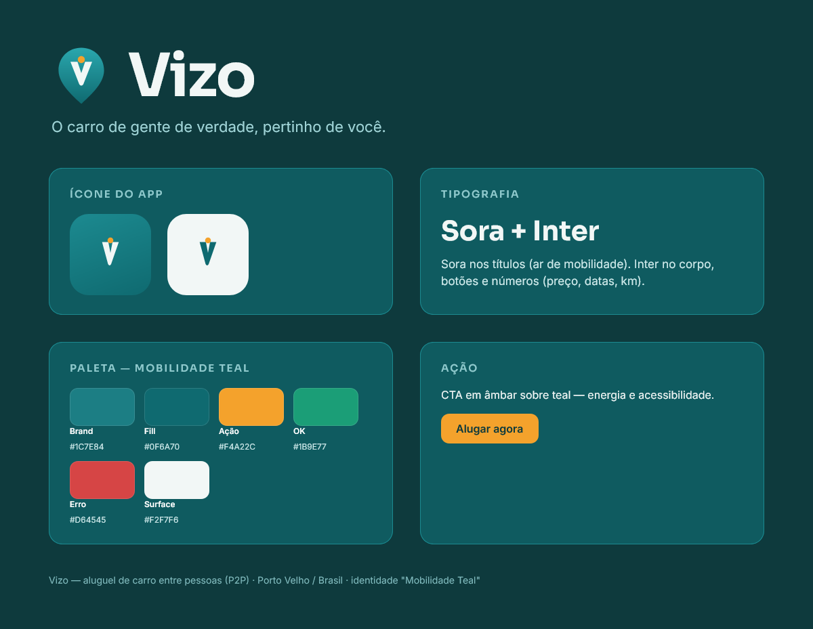

  

<h1 align="center">Vizo</h1>

<b>Aluguel de carro entre pessoas (P2P)</b> O carro de gente de verdade, pertinho de você.

  
  
  
  

---

## PT-BR

**Vizo** é o jeito de gente comum alugar (e ganhar com) um carro — com segurança e sem burocracia de locadora. Você aluga o carro de uma pessoa de verdade, perto de você. Mercado inicial: **Porto Velho / Brasil**.

**O que o app faz:** cadastro + verificação de CNH · anunciar seu carro · buscar e reservar · pagamento em **custódia** (o dinheiro só vai pro dono depois da devolução) · **vistoria com prova** (foto + data + local) · chat seguro · disputa com mediação · avaliação dos dois lados.

**Por que é diferente:** custódia do pagamento, vistoria imutável visível aos dois lados, e regras claras contra cobrança surpresa — as maiores dores de quem usa concorrentes lá fora.

## EN

**Vizo** is peer-to-peer car rental — rent a real person's car near you, safely and without rental-counter bureaucracy. Payment held in **escrow**, immutable photo+timestamp+geo inspections, two-sided reviews, in-app dispute mediation.

---

## Identidade

Identidade **"Mobilidade Teal"** (Sora + Inter). Teal transmite confiança e mobilidade; o âmbar dá energia e acessibilidade. O símbolo é um pin de localização com um "V" — local + gente + movimento.

## Screenshots

> Telas do app chegam após a rodada de testes em device. Enquanto isso, a prévia da identidade e do ícone está acima.

## O mascote

Vizo é um projeto do estúdio **Paulocodex** — guiado pelo mascote **Codex** (ninja + rolo de filme: dev com alma de audiovisual). Um mascote dedicado do Vizo (tema carro/teal) entra na fase final.

---

  

<b>Feito por Paulo</b> · estúdio <a href="https://paulocodex.com">Paulocodex</a> · app/site em 30 dias

